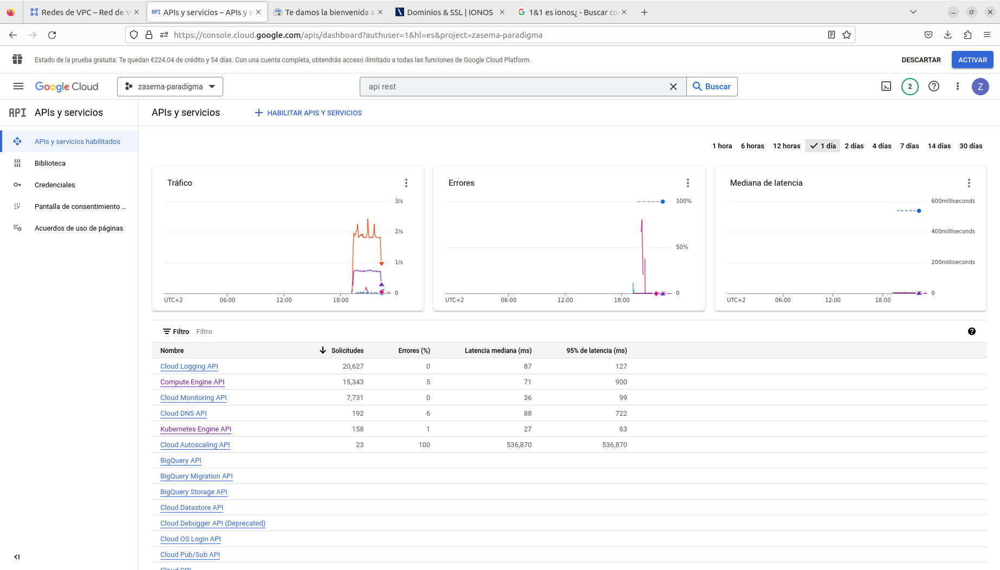
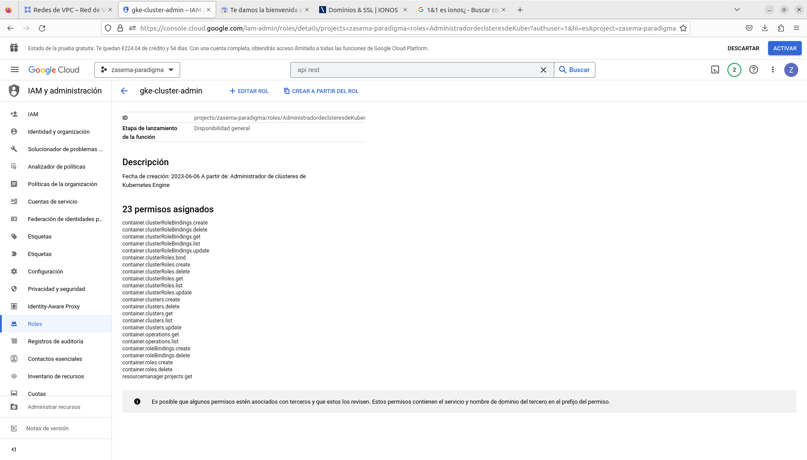

<a name="main"></a>

# **Despliegue en GCP con Terraform + Helm**

## Requisitos:

    -Linux
    -Git
    -Github
    -DockerHub
    -Terraform
    

A continuación En este proyecto se pueden encontrar los siguientes contenidos realizados con Terraform:

  - [Descripción de los elementos de Terraform.](#descripción-de-los-elementos-de-terraform)

  - [Proyecto en Google, APIs, credenciales, roles y permisos.](#proyecto-en-google-apis-credenciales-roles-y-permisos)

  - [Configuración de los "providers" (Google, Kubernetes, Helm).](#configuración-de-los-providers-google-kubernetes-helm)

  - [Creación de VPC network.](#creación-de-vpc-network)

  - [Reserva de IPs.](#reserva-de-ips)

  - [Despligue de GKE.](#despligue-de-gke)

  - [Despligue de recursos y aplicaciones mediante Helm.](#despligue-de-recursos-y-aplicaciones-mediante-helm)

  - [Despliegue y configuración zona DNS.](#despliegue-y-configuración-zona-dns)

  - [Comandos Terraform y gcloud.](#comandos-terraform-y-gcloud)

  ## Descripción de los elementos de Terraform.

Descripción de un bloque en Terraform:

```
resource "google_compute_network" "vpc_terraform" {
  name = "terraform-network"
}
```

El primer nombre es el nombre del servicio en la nube (google), el segundo su nombre en Terraform, y el "name" es el nombre que se le asigna al crearse en la nube.

Hay distintos tipos de elementos en Terraform, los que se han utilizado son:

  - Provider:    
    Terraform se basa en complementos llamados "proveedores" para interactuar con proveedores de nube, proveedores de SaaS y otras API.
    Las configuraciones de Terraform deben declarar qué proveedores requiere para que Terraform pueda instalarlos y usarlos. Además, algunos proveedores requieren configuración (como URL de punto final, región, autenticación...) antes de que puedan usarse.

  - Resource:    
    Los recursos son los elementos más importantes del lenguaje Terraform. Cada bloque de recursos describe uno o más objetos de infraestructura, como redes virtuales, instancias o componentes de nivel superior, como registros DNS.
  
  - Data:    
    Permiten que Terraform use información definida fuera de Terraform, definida por otra configuración separada de Terraform o modificada por funciones. (APIs o recursos de los proveedores)

    El lenguaje Terraform incluye algunos tipos de bloques para solicitar o publicar valores con nombre.    
  - Variable:    
    Sirven como parámetros para un bloque de Terraform, por lo que los usuarios pueden personalizar el comportamiento sin editar la fuente.
  - Output:    
    Son valores de retorno de las variables o bloques de Terraform.

Opción interesante de los bloques de Terraform:

  - depend_on: Cuando se le quiere indicar a Terraform una orden de creación de los distintos recursos.

## Proyecto en Google, APIs, credenciales, roles y permisos.

Para realizar todas las tareas anteriores se han realizado previamente algunas configuraciones en la plataforma web de google, o por CLI:

  - Creación de proyecto:    
    Previamente se ha creado una cuenta de correo electrónico Google para poder vincularlo con la consola de GCP, zasema.devops@gmail.com, tras esto nos registramos desde el navegador en GCP aprovechando los 300 $ que dan a las cuentas nuevas, aunque tengas que vincular datos bancarios por si se sobrepasase ese crédito.    

  - Habilitar APIs:    
    En la siguiente imagen se muestran las APIs necesarias para la creación de todos los recursos que se han mencionado anteriormente, algunas activadas por defecto otras hay que habilitarlas manualmente, en nuestro caso tuvimos que activar para lanzar el terraform apply las APIs Compute Engine API y Kubernetes Engine API:    

      

  - Miembros/claves asociadas del Proyecto:    
    En la siguiente captura se puede observar la cuenta de servicio añadida para gestionar el proyecto y otra que se crea automáticamente al habilitar las APIs:    

          

  - Credenciales y permisos del usuario del proyecto:    
    Las cuentas de servicio de un proyecto tiene distintos roles que le concede permisos sobre los distintos componentes de la nube, desde editor del proyecto hasta administrador de GKE, entre miles de cosas, dependiendo de lo que se quiera realizar con la cuenta de servicio, en las siguientes imágenes se verá los permisos que tiene la cuenta de servicio de nuestro proyecto, y una el rol que tuvimos que crear y los permisos que tuvimos que añadir que se nos pedían mientras se lanzaba el terraform apply para desplegar los distintos recursos desde terraform.    

          

    Para ver más datos sobre los roles distintos roles del cluster pulsa [aquí](https://cloud.google.com/kubernetes-engine/docs/how-to/iam).    

    Para el despligue y creación de recursos en el cluster, se necesita, además, crear una serie de permisos que esta definido en el fichero "clusterrolebindig.tf" con  el  cual se le da permisos al usuario de terraform, como si fuera administrador.

## Configuración de los "providers" (Google, Kubernetes, Helm).

Como se ha visto en el apartado Descripción de los elementos de Terraform, se necesita iniciar el plugin del proveedor que Terraform utilizará para comunicarse con la nube pública, que en este caso la que hemos elegido es Google Cloud.

Esta configuración se realiza en el fichero "provider.tf":

En primer lugar se carga el plugin a utilizar por Terraform de Google y mediante unas credenciales (token) y parámetros se le hace referencia a un proyecto, en este caso se pueden apreciar que usamos el uso de variables para especificar los parámetros del proyecto.

```
#Versión del plugin del proveedor que utiliza terraform para google.
terraform {
  required_providers {
    google = {
      source  = "hashicorp/google"
      version = "4.65.2"
    }
  }
}

#Credenciales para conectar con el proyecto en google.
provider "google" {
  credentials = file("cred.json")
  project     = var.project_id
  region      = var.region
  zone        = var.zone
}
```

A continuación, se utiliza el provider de Kuberentes:

El proveedor de Kubernetes (K8S) se utiliza para interactuar con los recursos admitidos por Kubernetes. El proveedor debe configurarse con las credenciales adecuadas antes de que se pueda utilizar. Además de la autenticacíon de la cuenta, se necesita que el cluster esté previamente creado, en este caso se utiliza GKE que se comentará más adelante.

```
# Obtener datos de la cuenta para utilizarlos. en este caso para el token de autenticación
 data "google_client_config" "provider" {}

#Configuración para poder crear recursos en kubernetes, se utiliza un provider. (Se utiliza el data anterior)
provider "kubernetes" {
  host                   = "https://${google_container_cluster.zasema_paradigma_cluster.endpoint}:443"
  cluster_ca_certificate = base64decode("${google_container_cluster.zasema_paradigma_cluster.master_auth.0.cluster_ca_certificate}")
  token                  = data.google_client_config.provider.access_token
  }
```

Se hace uso de un tipo "data", además de las otras variables para obtener los datos de la configuración de este bloque de "provider"

También se configurará el proveedor de Helm:

El proveedor de Helm se utiliza para implementar paquetes de software en Kubernetes. El proveedor debe configurarse con las credenciales adecuadas antes de que se pueda utilizar, como en el caso anterior también necesita que el cluster este previamente creado.

```
provider "helm" {
  kubernetes {
    host                   = "https://${google_container_cluster.zasema_paradigma_cluster.endpoint}:443"
    client_certificate     = base64decode("${google_container_cluster.zasema_paradigma_cluster.master_auth.0.client_certificate}")
    client_key             = base64decode("${google_container_cluster.zasema_paradigma_cluster.master_auth.0.client_key}")
    cluster_ca_certificate = base64decode("${google_container_cluster.zasema_paradigma_cluster.master_auth.0.cluster_ca_certificate}")
    token                  = data.google_client_config.provider.access_token
  }
}
```

Como en el provider de kubernetes, se hace uso de un tipo "data" para obtener algunos de los valores para la configuración de este bloque de provider además de otras variables para obtener los certificados y endpoint del cluster.

## Creación de VPC network.

En este apartado se creará una Virtual Private Cloud network para utilizar en nuestro proyecto, en este caso el fichero utilizado es "networking.tf"

```
#Recursos de red del proyecto
resource "google_compute_network" "zasema_paradigma_vpc" {
  project                                   = var.project_id
  name                                      = "zasema-paradigma-vpc"
  auto_create_subnetworks                   = true
  network_firewall_policy_enforcement_order = "BEFORE_CLASSIC_FIREWALL"
}
```

Algo a comentar, es que se crea por defecto una red VPC en cada región.

## Reserva de IPs.

Para exporner las aplicaciones al exterior mediante necesitamos reservar varias IPs, para ello se utiliza el fichero "ips.tf"

```
#IP fijas para los recursos
resource "google_compute_address" "ipv4_fastapi" {
  name = "ipv4-fastapi"
}

resource "google_compute_address" "ipv4_prometheus" {
  name = "ipv4-prometheus"
}

resource "google_compute_address" "ipv4_grafana" {
  name = "ipv4-grafana"
}

resource "google_compute_address" "ipv4_alertmanager" {
  name = "ipv4-alertmanager"
}
```

Estas IPs son asignadas por el proveedor, se puede averiguar cuáles son con los elementos "outputs" que se comentaron anteriormente. Aunque se utilizará un dominio comprado en Ionos para poder acceder desde el navegador conforme a las Ips que asigne Google Cloud en el despliegue.

## Despligue de GKE.

Una vez tenemos configurado el plugin del proveedor de Google y las credenciales al proyecto, es hora de crear el cluster utilizando el servicio de Google llamado GKE (Google Kubernetes Engine) se utiliza el fichero "gke.tf"

Se despliega un cluster zonal, esto quiere decir, que se lanza el cluster en una zona específica de la región, ya que si esto no se especifica se crearía un cluster regional y duplicaría los nodos por cada zona de la región.

A continuación, se verá la configuración del fichero "gke.tf".

```
#Recursos GKE
resource "google_container_cluster" "zasema_paradigma_cluster" {
  name     = var.project_id
  location = var.region

  node_config {
    disk_size_gb = 15
    machine_type = "e2-standard-2"
  }
  cluster_autoscaling {
    enabled = true
    resource_limits {
      resource_type = "cpu"
      maximum       = 2
    }
    resource_limits {
      resource_type = "memory"
      maximum       = 4
    }
  }
  remove_default_node_pool = true
  initial_node_count       = 1
  network                  = google_compute_network.zasema_paradigma_vpc.id

  #ignorar los cambios para que no se destruya el recurso
  lifecycle {
    ignore_changes = all
  }
}
```

Lo primero que se realiza es crear el cluster (nodo master), el cual por defecto al iniciarse crea un nodo (worker)

Una vez el cluster esta desplegado, se añadirá y configurará con el siguiente bloque de Terraform:
```
# Creamos los nodos despues de desplegar el cluster.
resource "google_container_node_pool" "primary_nodes" {
  name       = "${google_container_cluster.zasema_paradigma_cluster.name}-node-pool"
  location   = var.zone
  cluster    = google_container_cluster.zasema_paradigma_cluster.id
  node_count = var.gke_num_nodes

  node_config {
    disk_size_gb = 15
    machine_type = "e2-standard-2"
    oauth_scopes = [
      "https://www.googleapis.com/auth/logging.write",
      "https://www.googleapis.com/auth/monitoring",
    ]

    labels = {
      env = var.project_id
    }

    tags = ["gke-node", "zasema-paradigma-gke"]
    metadata = {
      disable-legacy-endpoints = "true"
    }
  }

  lifecycle {
    ignore_changes = all
  }
}
```

Además, se configura el tipo de máquina a utilizar para los nodos, en este caso el tipo "e2-standard-2" que consta de 2 CPU y 8GB de RAM también nos permitiría realizar el autoescalado, otro tipo de máquinas no lo permite como las de la serie N1.

## Despligue de recursos y aplicaciones mediante Helm

Una vez que se han establecido los permisos necesarios (vea sección de permisos [aquí](#proyecto-en-google-apis-credenciales-roles-y-permisos)), vamos a desplegar en dos arcivos, uno para la fastapi y otro para prometheus. Para desplegar la fastapi utilizamos los bloques de Terraform que están en el fichero "helm_paradigma_fastapi.tf"

```
# Creando namespace fastapi
resource "kubernetes_namespace" "paradigma_fastapi" {
  metadata {
    name = "paradigma-fastapi"
  }
}

# Desplegando ingress-controler con helm para el namespace de la app
resource "helm_release" "helm_app_fastapi" {
  name             = "app-fastapi-paradigma"
  chart            = "../../k8s/paradigma"
  namespace        = kubernetes_namespace.paradigma_fastapi.metadata[0].name
  create_namespace = true
  wait             = true

  # Esperar al despliegue de kube-prometheus-stack
  depends_on = [
    helm_release.helm_prometheus_fastapi
  ]

  set {
    name  = "controller.service.loadBalancerIP"
    value = google_compute_address.ipv4_fastapi.address
  }
}
```

En primer lugar, se utiliza un bloque de Terraform que crea un par de namespaces utilizando "kubernetes" (previamente se agregó a los providers), luego con el siguiente se despliega prometheus, mediante el archivo "helm_prometheus.tf".

```
# Creando namespace fastapi
resource "kubernetes_namespace" "prometheus_fastapi" {
  metadata {
    name = "monitoring"
  }
}

# Instalar el chart de kube-prometheus-stack
resource "helm_release" "helm_prometheus_fastapi" {
  name              = "prometheus"
  repository        = "https://prometheus-community.github.io/helm-charts"
  chart             = "kube-prometheus-stack"
  namespace         = kubernetes_namespace.prometheus_fastapi.metadata[0].name
  create_namespace  = true
  wait              = true

  values = [
    file("../../k8s/kube-prometheus-stack/values.yaml")
  ]

  set {
    name  = "prometheus.service.loadBalancerIP"
    value = google_compute_address.ipv4_prometheus.address
  }

  set {
    name  = "alertmanager.service.loadBalancerIP"
    value = google_compute_address.ipv4_alertmanager.address
  }
  
   set {
    name  = "grafana.service.loadBalancerIP"
    value = google_compute_address.ipv4_grafana.address
  }

}
```

Los parámetros indican el repositorio a utilizar, el "chart" de dicho repositorio, el namespace donde se tiene que desplegar. También se indican las IPs que debe coger cada servicio desplegado con este chart.


## Despliegue y configuración zona DNS.
Antes de configurar la zona DNS se ha adquirido un dominio en "Google Domains", en el fichero dns.tf se realiza la creación de zona y se agregan los registros:

```
# Creando la zona dns
resource "google_dns_managed_zone" "zasema_paradigma_zone" {
  name        = "zasema-paradigma-zone"
  dns_name    = "zasema-paradigma.com."
  description = "Zona DNS del proyecto zasema-paradigma"
}
```

Al crear la zona en "dns_name" se agrega el dominio.

Luego en los siguientes bloques se crean los siguientes registros, tipo "A"

```

#Añadiendo el registro "A" de app a la zona dns para la fastapi
resource "google_dns_record_set" "zasema_paradigma_fastapi_dns" {
  managed_zone = google_dns_managed_zone.zasema_paradigma_zone.name
  name         = "fastapi.zasema-paradigma.com."
  type         = "A"
  rrdatas      = [google_compute_address.ipv4_fastapi.address]#ip que se le asigna
  ttl          = 300
}
#Añadiendo el registro "A" de app a la zona dns para prometheus
resource "google_dns_record_set" "zasema_paradigma_prometheus_dns" {
  managed_zone = google_dns_managed_zone.zasema_paradigma_zone.name
  name         = "prometheus.zasema-paradigma.com."
  type         = "A"
  rrdatas      = [google_compute_address.ipv4_prometheus.address]#ip que se le asigna
  ttl          = 300
}

#Añadiendo el registro "A" de app a la zona dns para grafana
resource "google_dns_record_set" "zasema_paradigma_grafana_dns" {
  managed_zone = google_dns_managed_zone.zasema_paradigma_zone.name
  name         = "grafana.zasema-paradigma.com."
  type         = "A"
  rrdatas      = [google_compute_address.ipv4_grafana.address]#ip que se le asigna
  ttl          = 300
}

#Añadiendo el registro "A" de app a la zona dns para alertmanager
resource "google_dns_record_set" "zasema_paradigma_alertmanager_dns" {
  managed_zone = google_dns_managed_zone.zasema_paradigma_zone.name
  name         = "alertmanager.zasema-paradigma.com."
  type         = "A"
  rrdatas      = [google_compute_address.ipv4_alertmanager.address]#ip que se le asigna
  ttl          = 300
}
```

Una vez realizado esto solo queda cambiar en la gestión del dominio adquirido los dns que ha proporcionado GCP para la zona que ahora se administra mediante terraform.

## Comandos Terraform y gcloud.
En este apartado aportamos dos enlaces interesantes donde se pueden consultar los comandos terraform y gcloud y sus distintos parámetros que nos ha servido de guía para el despliegue de la infraestuctura:
 - Lista de parametros para Terraform [aquí](https://bit.ly/3vkZIq0).    
 - Lista de parametros para gcloud [aquí](https://cloud.google.com/sdk/gcloud/reference).
 - Método para conectar el clúster de GKE como si estuviera en tu máquina [aquí](https://cloud.google.com/kubernetes-engine/docs/how-to/cluster-access-for-kubectl?hl=es-419).
