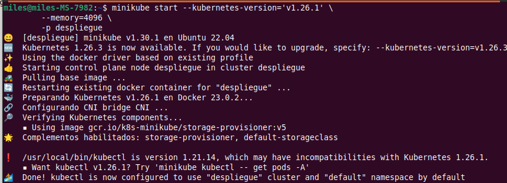
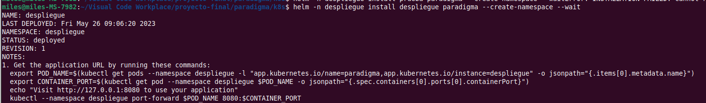
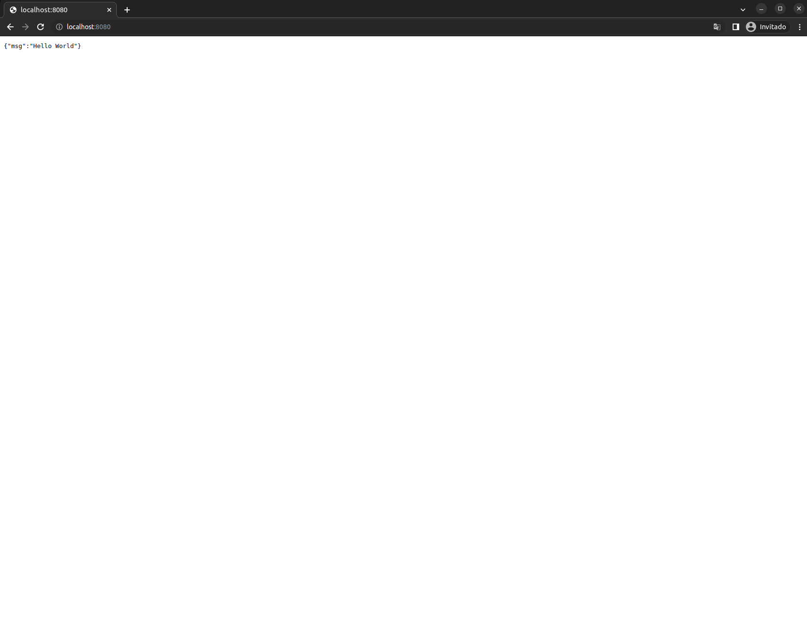

<a name="main"></a>

# **Despliegue en Kubernetes**

## Requisitos:

    -Linux
    -Git
    -Github
    -Docker
    -DockerHub
    -Minikube
    -Kubernetes
    -Helm


## Despliegue en K8s usando administrador de paquetes Helm

    minikube start --kubernetes-version='v1.26.1' \
        --memory=4096 \
        -p despliegue 
        


## Lanzar la app mediante helm

    helm install despliegue paradigma

    helm -n despliegue upgrade --install paradigma --create-namespace --wait




## Abrir los puertos para poder acceder a ella

    export POD_NAME=$(kubectl get pods --namespace despliegue -l "app.kubernetes.io/name=paradigma,app.kubernetes.io/instance=prueba" -o jsonpath="{.items[0].metadata.name}")
    export CONTAINER_PORT=$(kubectl get pod --namespace despliegue $POD_NAME -o jsonpath="{.spec.containers[0].ports[0].containerPort}")
    kubectl --namespace despliegue port-forward $POD_NAME 8080:$CONTAINER_PORT




<br>

# **Despliegue en Kubernetes con monitorización y alertas**

Para implementar monitorización sobre el sistema se ha optado por utilizar `kube-prometheus-stack`.   
Se trata de un chart de [Helm](https://helm.sh/) gracias al cual se consiguen desplegar los servicios 
[Prometheus](https://prometheus.io/) y [Grafana](https://grafana.com/) en un clúster de 
[Kubernetes](https://kubernetes.io/), siguiendo los pasos descritos en la documentación de su 
[repositorio de Github](https://github.com/prometheus-community/helm-charts/tree/main/charts/kube-prometheus-stack).  

En cuanto al sistema de alertas, se ha implementado un `Incoming Webhook` integrado con la plataforma 
[Slack](https://slack.com/), en el canal `#paradigma` del espacio de trabajo [Zasema](https://zasema.slack.com/).

<br>


## Despliegue con minikube

1. Crear clúster minikube, con los plugins indicados:
    ```
    minikube start --kubernetes-version='v1.26.1' \
        --memory=4096 \
        --addons="metrics-server,default-storageclass,storage-provisioner" \
        -p monitoring-paradigma
    ```

2. Añadir repositorio Helm de Prometheus:
    ```
    helm repo add prometheus-community https://prometheus-community.github.io/helm-charts
    helm repo update
    ```

3. Definir `values.yaml` personalizado:
    ```
    . . .
    alertmanager:
        config:
            global:
            resolve_timeout: 5m
            route:
            group_by: ['job']
            group_wait: 30s
            group_interval: 5m
            repeat_interval: 12h
            receiver: 'slack'
            routes:
            - match:
                alertname: Watchdog
                receiver: 'null'
            # This inhibt rule is a hack from: https://stackoverflow.com/questions/54806336/how-to-silence-prometheus-alertmanager-using-config-files/54814033#54814033
            inhibit_rules:
            - target_match_re:
                alertname: '.+Overcommit'
                source_match:
                alertname: 'Watchdog'
                equal: ['prometheus']
            receivers:
            - name: 'null'
            - name: 'slack'
            slack_configs:
            - api_url: '' # <<- Aquí el Webhook URL
                send_resolved: true
                channel: '#paradigma' <<--- Aquí el canal
    . . .
    ```

4. Desplegar chart:
    ```
    helm -n monitoring upgrade --install prometheus prometheus-community/kube-prometheus-stack -f path/to/personal/values.yaml --create-namespace --wait --version 34.1.1
    ```

5. Redirigir puertos:
    ```
    kubectl -n monitoring port-forward svc/prometheus-kube-prometheus-prometheus 9090:9090
    kubectl -n monitoring port-forward svc/prometheus-grafana 3000:http-web
    ```

<br>


## Definición de alertas

En el propio fichero `values.yaml` se definen las alertas del componente Alertmanager, mediante el lenguaje de expresiones de Prometheus:
```
additionalPrometheusRulesMap:
  forced-alert-rules:
    groups:
      - name: forced_ruleset_1
        rules:
          - alert: paradigmaForced
            expr: sum(container_memory_usage_bytes{namespace="paradigma"}) > 1
            for: 0s
            labels:
              severity: warning
              alertname: "forced paradigma alert"
            annotations:
              summary: Pod {{ $labels.pod }} forced alert
              description: "Forced alert"

  paradigma-alert-rules:
    groups:
      - name: paradigma_ruleset_1
        rules:
          - alert: paradigmaConsumingMoreThanRequest
            expr: sum(avg(container_memory_usage_bytes{namespace="paradigma"}) by (pod)) > sum(avg(kube_pod_container_resource_requests{resource="memory",namespace="paradigma"})) by (pod)
            for: 0s
            labels:
              severity: critical
              alertname: "paradigma consuming more memory than requested"
            annotations:
              summary: Pod {{ $labels.pod }} consuming more memory than requested
              description: "Pod more less than request"
              message: Pod {{ $labels.pod }} is consuming more memory than requested
...
```

<br>


# [**Índice de contenidos**](../README.md#main)
- [**Equipo**](../README.md#team)
- [**Descripción**](../README.md#desc)
- [**Despliegue en entorno local**](../README.md#rc_local)
- [**Despliegue en Kubernetes**](#main)

<br>

[Volver arriba](#main)